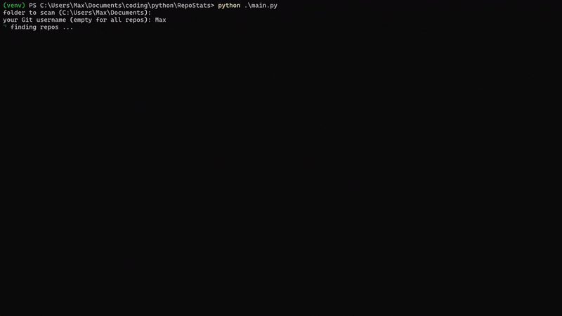

# RepoStats

See some cool graphics and statistics on your local projects! Directly in your terminal.

## Installation

1. Download the repo [[zip](https://github.com/Aerodynamax/RepoStats/archive/refs/heads/main.zip)]
2. Open the repo in your terminal of choice
3. Enter a virtual environment [optional]

```powershell
python -m venv venv # create a virtual python environment
.\venv\Scripts\Activate.ps1 # enter virtual environment
```

4. Install dependencies

```powershell
pip install -r requirements.txt
```

5. Run the script (THERE ARE TWO, SEE BELOW)

## All Repos

See a GitHub-style contribution\* graph for _all_ your projects, rendered in a minimal TUI.



\* the contribution graph currently only tracks commits.

### Run

After following the installation process outlined above:

```
python main.py
```

There are currently no command line arguments though this is subject to change.

## Per Repo

Along with a GitHub-style contribution\* graph exclusively for this project, this view also displays contribution statistics in both table and pie chart forms!
Project information (like its description, remotes & branches) is also displayed next to the contributions statistics.


\* the contribution graph currently only tracks commits.

### Run

After following the installation process outlined above:

```
python individual_repo.py
```

There are currently no command line arguments though this is subject to change.
